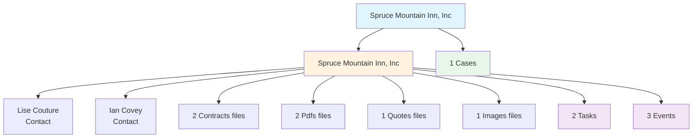
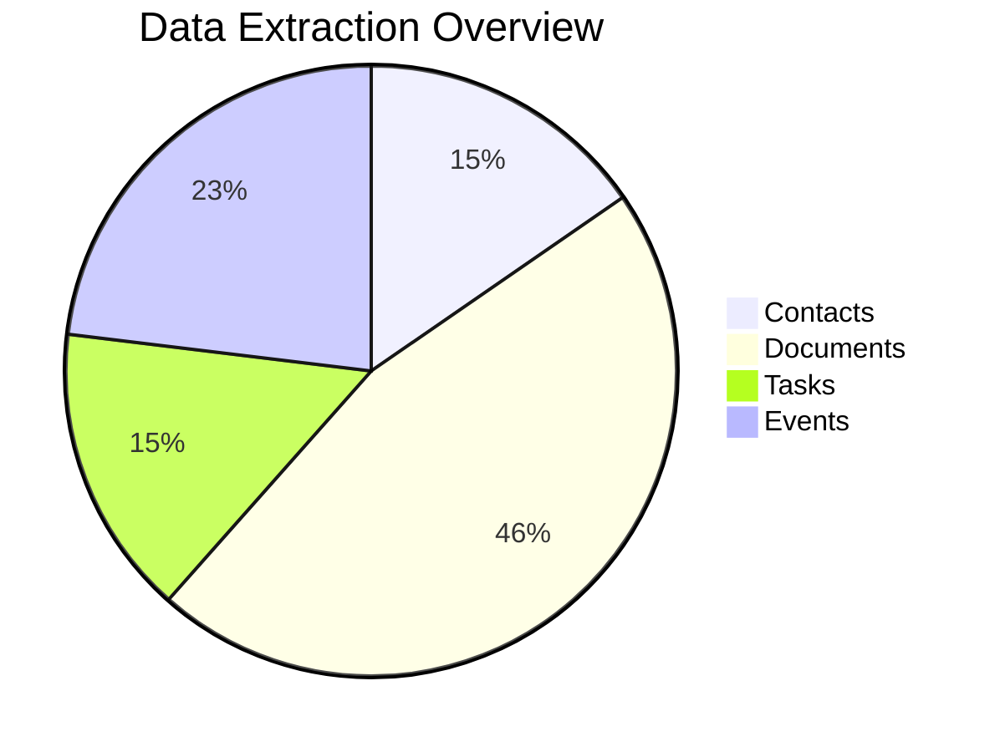
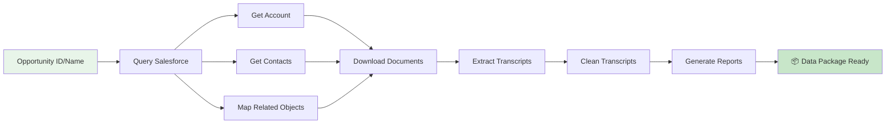
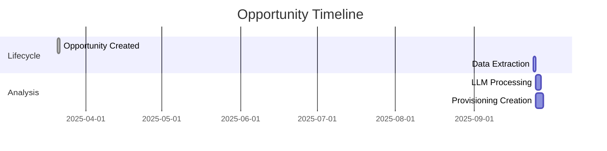
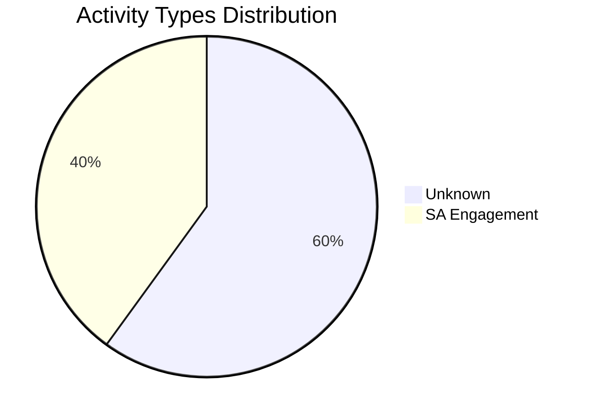

# Salesforce Opportunity Data Extraction Report

## 📊 Executive Summary

**Opportunity:** Spruce Mountain Inn, Inc  
**ID:** 006Pq00000Qb93lIAB  
**Account:** Spruce Mountain Inn, Inc  
**Stage:** Closed Won  
**Amount:** $342.90  
**Close Date:** 2025-08-29  

**Extraction Date:** 2025-09-24 15:44:21  
**Processing Time:** 0.00 seconds  

## 🗂️ Data Extraction Metrics

| Category | Count | Status |
|----------|-------|--------|
| Contacts | 2 | ✅ Extracted |
| Contact Roles | 2 | ✅ Extracted |
| Documents | 6 | 6 Downloaded |
| Transcripts | 0 | ✅ Extracted |
| Tasks | 2 | ✅ Mapped |
| Events | 3 | ✅ Mapped |
| Cases | 1 | ✅ Mapped |

## 🔗 Object Relationships



## 📈 Data Completeness



## 🔄 Extraction Process Flow



## 📅 Timeline





## 👥 Key Contacts

| Name | Title | Email | Phone | Role |
|------|-------|-------|-------|------|
| Lise Couture | None | lcouture@sprucemountainiin.com | 8022796896 | Admin |
| Ian Covey | None | adminassistant@sprucemountaininn.com | 802-498-5624 | Install Contact |

## 📄 Document Inventory

### By Type

**Contracts (2 files, 0.5 MB total):**
- Spruce Montain BOF signed (0.31 MB)
- Spruce Mountain Inn - LOA Signed (0.20 MB)

**Images (1 files, 0.3 MB total):**
- IRR Spruce Mountain (0.32 MB)

**Pdfs (2 files, 0.2 MB total):**
- Spruce - 513760610_20250904125333 - COB #1 (0.12 MB)
- Spruce - 513760726_20250904125233 - COB #2 (0.11 MB)

**Quotes (1 files, 0.1 MB total):**
- Spruce Mountain Inn - Quote Signed (0.07 MB)

## 📌 Recent Activity

### Last 10 Activities
| Type | Subject | Date | Owner |
|------|---------|------|-------|
| Event | Reached out to Dave to see if opp still on table, ... | 2025-08-20 | Christine Rosa |
| Event | f/u on opp. close eom | 2025-08-16 | Tanya Karlovic |
| Task | Notes | 2025-08-15 | Dan Long |
| Event | Reached out to Rowdy to get update of when they ma... | 2025-04-24 | Christine Rosa |
| Task | Notes | 2025-03-24 | Dan Long |

## ⚠️ Extraction Issues

The following issues were encountered during extraction:

- Query failed for VoiceCall: 
            FROM Task 
                 ^
ERROR at Row:7:Column:18
Entity 'Task' is not supported for semi join inner selects

## 🎯 Next Steps for LLM Analysis

1. **Transcript Analysis**
   - Process cleaned transcripts in `data/006Pq00000Qb93lIAB/transcripts/cleaned/`
   - Extract customer requirements and specifications
   - Identify key decision points and commitments

2. **Document Review**
   - Analyze quotes for pricing and service details
   - Review contracts for terms and conditions
   - Extract technical specifications from spreadsheets

3. **Contact Mapping**
   - Identify decision makers and technical contacts
   - Map organizational hierarchy
   - Determine communication preferences

4. **Provisioning Data Extraction**
   - Use the 80-attribute template from `provs/broadvoice_attributes_requirements.csv`
   - Apply 4-pass extraction methodology
   - Generate provisioning CSV with confidence scores

5. **Validation**
   - Cross-reference data across multiple sources
   - Flag missing critical information
   - Prepare follow-up questions for sales team

## 📁 Output Directory Structure

```
data/006Pq00000Qb93lIAB/
├── metadata.json           # Complete extraction metadata
├── opportunity.json        # Opportunity details
├── account.json           # Account information
├── contacts.json          # All contacts
├── summary.md             # This report
├── documents/
│   ├── quotes/           # Quote documents
│   ├── contracts/        # Contract documents  
│   ├── emails/           # Email exports
│   ├── spreadsheets/     # Excel/CSV files
│   ├── pdfs/            # PDF documents
│   └── other/           # Other file types
└── transcripts/
    ├── raw/             # Original transcripts
    └── cleaned/         # Processed transcripts
```

## 🔍 Data Quality Assessment

**Overall Data Quality:** MEDIUM  
**Total Queries Executed:** 31  
**Documents Downloaded:** 6 of 6  
**Transcripts Extracted:** 0  
**Total Errors:** 1  

---

*Generated by Salesforce Opportunity Extractor*  
*Processing completed at 2025-09-24T15:44:21.702810*
